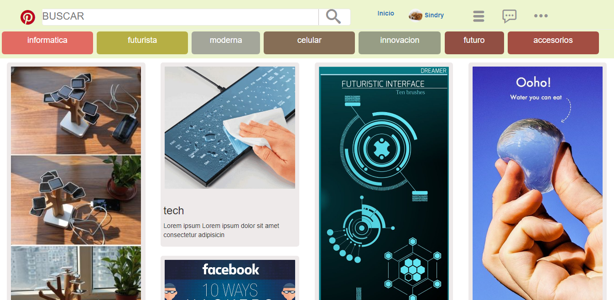

## PINTEREST

Pinterest es una aplicación que permite a los usuarios compartir, crear y administrar colecciones de imagenes como eventos entre otros intereses del usuario.

### DESARROLLADO PARA

[Laboratoria](http://laboratoria.la).

